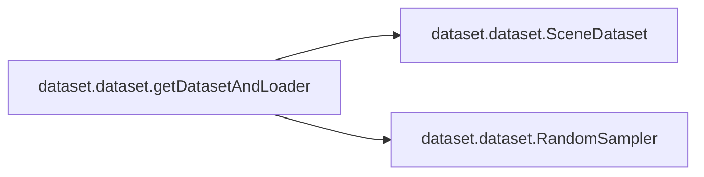

# Dataset Dataset

[_Documentation generated by Documatic_](https://www.documatic.com)

<!---Documatic-section-Codebase Structure-start--->
## Codebase Structure

<!---Documatic-block-system_architecture-start--->
```mermaid
None
```
<!---Documatic-block-system_architecture-end--->

# #
<!---Documatic-section-Codebase Structure-end--->

<!---Documatic-section-dataset.dataset.getDatasetAndLoader-start--->
## [dataset.dataset.getDatasetAndLoader](3-dataset_dataset.md#dataset.dataset.getDatasetAndLoader)

<!---Documatic-section-getDatasetAndLoader-start--->


### Object Calls

* dataset.dataset.SceneDataset
* dataset.dataset.RandomSampler

<!---Documatic-block-dataset.dataset.getDatasetAndLoader-start--->
<details>
	<summary><code>dataset.dataset.getDatasetAndLoader</code> code snippet</summary>

```python
def getDatasetAndLoader(root, conds_lens, batch_size, shuffle, num_workers, opt_pose, opt_trans, opt_camera):
    dataset = SceneDataset(root, conds_lens)
    if opt_pose:
        dataset.poses.requires_grad_(True)
    if opt_trans:
        dataset.trans.requires_grad_(True)
    dataset.opt_camera_params(opt_camera)
    sampler = RandomSampler(dataset, 1, shuffle)
    dataloader = torch.utils.data.DataLoader(dataset, batch_size, sampler=sampler, num_workers=num_workers)
    return (dataset, dataloader)
```
</details>
<!---Documatic-block-dataset.dataset.getDatasetAndLoader-end--->
<!---Documatic-section-getDatasetAndLoader-end--->

# #
<!---Documatic-section-dataset.dataset.getDatasetAndLoader-end--->

[_Documentation generated by Documatic_](https://www.documatic.com)